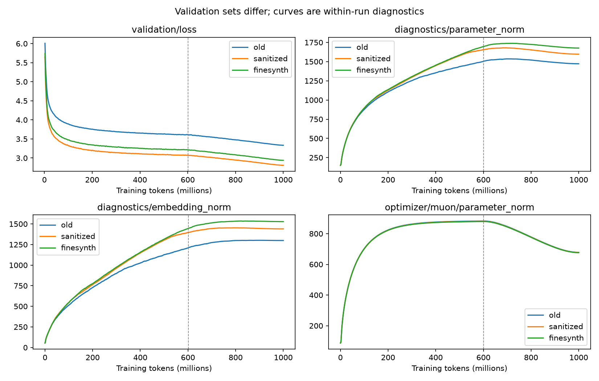

The evidence points primarily to distribution changes and persistent templated web spam, with a separate synthetic-data trade-off. It does not support a large source-order bias during decay or straightforward exact train/test leakage. Cleaner Italian-language text is not necessarily better Italian prose, and the cleaned artifacts contain concrete examples of that distinction.

This audit compares the three local datasets and their corresponding `35m_balanced_1b`, `35m_newbalsanitized_1b`, and `35m_finesynth_1b` checkpoints. The experiments include metadata and decoded-token inspection, training-order reconstruction, TensorBoard analysis, saved benchmark comparisons, and evaluation on identical source-stratified samples. Full-set reevaluations remain correlated with the reported validation-prefix scores; the prefix limitation alone does not explain the observed behavior.

The three runs have 34,191,744 parameters and matching recorded architecture, initialization, optimizer settings, seed, sequence length, and training horizon. Each processes 999,997,440 tokens in 61,035 steps, with one epoch and WSD decay over the final 40% of post-warmup steps. Their recorded settings are a controlled starting point; checkpoints do not record the historical code revision.

**The most useful finding is that some of the cleaned model's largest validation gains are on incoherent SEO templates.** For example, a sanitized validation block beginning at token 2,936,832 contains e-cigarette shop keywords mixed with random names, mountains, objects, and verbs. The old model's loss is 4.585, while the sanitized model's loss is 2.552. Another at 3,276,800 improves from 4.487 to 2.492. A sanitized test block at 3,993,600 improves from 4.134 to 2.154. These blocks are syntactically Italian-looking but do not express coherent prose.

For a short illustration from the first block: “Antonella ha controminato il trono apprezzabile multando a punti vendita sigarette elettroniche Marmentino.” This is retained text, not a model generation. The full decoded blocks and their paired losses are saved in `artifacts/dataset_audit/raw/web_largest_gains.json`.

To assess the size of this effect, I grouped evaluated web blocks using broad finance/vaping keywords. This includes legitimate articles, so the table measures topic concentration rather than a verified spam rate. The grouping was discovered after inspecting losses and should be treated as exploratory.

| Sanitized evaluation web sample | Finance/vaping share | Old loss on flagged blocks | Sanitized loss on flagged blocks | Flagged blocks' share of web loss improvement |
|---|---:|---:|---:|---:|
| Validation | 21.9% | 3.216 | 2.012 | 67.6% |
| Test | 19.5% | 3.178 | 2.033 | 57.6% |

On the other sanitized test web blocks, losses are 3.384 for old and 3.179 for sanitized. Thus there is also improvement outside these topics; the data does not support attributing every gain to spam. However, the finance/vaping group alone contributes approximately 0.112 nats/token to the complete mixture's 0.218-nat sampled test advantage, about half. Several of the largest improvements are visibly templated gibberish, and topic concentration is independently present in uniform token samples: finance/vaping terms occur in 16.5% of sampled sanitized training web blocks and 22.5% of its test web blocks, compared with 5.3% and 6.3% in old. These are 400-block samples per source, separate from the loss samples.

Train and validation can share bad template families without sharing identical documents. A model can generalize successfully within that family and get a better full-set validation loss while gaining little useful language ability. This is distribution-specific learning, and it does not require memorizing evaluation examples.

**The source mixtures changed substantially.** All three artifacts contain exactly one billion tokens and use the same verified 16,384-token SentencePiece model, with SHA-256 `88575f7c0f8891e1caf885a4fbfbc453604170422f6571ea75e0a5d807272890`.

| Training artifact | Web | Wikipedia family | Books | Educational PDFs | SYNTH |
|---|---:|---:|---:|---:|---:|
| Old balanced | 40% | 20% | 20% | 20% | 0% |
| Sanitized | 50% | 25% | 0% | 25% | 0% |
| FineSynth | 40% | 20% | 0% | 20% | 20% |

The newer datasets therefore do not isolate cleaning. They remove 200M book tokens, change the remaining weights, use different acquisition/cleaning procedures, and change the document split key from source/document ID to normalized-document hash. Only two complete old training chunks are exactly identical to sanitized training chunks, whereas sanitized and FineSynth share roughly 762M tokens in identical complete chunks. This measures exact token identity, not semantic independence; preprocessing changes can destroy exact matches.

FineSynth is also more than a synthetic addition: its web region has 362,113,358 tokens from the parent pool and 37,886,642 from a supplement. Its validation and test are entirely natural 50/25/25 mixtures. Approximately 93.8% of sanitized validation tokens and 94.5% of sanitized test tokens are represented by identical complete chunks in their FineSynth counterparts. A comparison of these two models is consequently much closer than old-versus-new, but still includes a natural-web change and a reduction in natural training tokens.

**The cross-dataset loss pattern is mostly reproducible, with one important exception.** This diagnostic uses 128 uniformly selected, non-overlapping 1,024-token blocks per source in every validation and test pool, plus 64 per training source. All models see exactly the same offsets. Aggregates use each artifact's actual token weights. Models use FP32 parameters, BF16 autocast, and strict checkpoint loading. These sampled results are distinct from the complete-set paired-loss experiment linked below.

| Model trained on | Old test | Sanitized test | FineSynth natural test |
|---|---:|---:|---:|
| Old balanced | **3.400** | 3.257 | 3.218 |
| Sanitized | 3.735 | **3.039** | **3.052** |
| FineSynth | 3.752 | 3.066 | 3.076 |

The sanitized model beats FineSynth on both newer natural test distributions in this sample. The paired difference on FineSynth test is 0.024 nats/token in favor of sanitized, with an approximate block-sampling 95% interval of 0.020–0.028. This does not measure training-seed uncertainty or correlation between blocks from the same document/template. It is sufficient to question a strict “every model wins only its own test” explanation for these particular checkpoints.

Much of the old-test disadvantage is books. Old, sanitized, and FineSynth losses on the same old-test book sample are 4.340, 5.662, and 5.685. For sanitized versus old, books contribute 0.264 of the total 0.335-nat old-test penalty, about 79%. The models also differ on old web/wiki/PDF data, but the removed book source dominates the aggregate gap. A low loss on the newer mixtures cannot be compared directly with the old mixture's loss as an absolute model-quality measure.

There is little sign of a large ordinary train/evaluation gap in the source-matched samples. For instance, sanitized's own sampled training loss is 3.029, validation 2.996, and test 3.039. These samples differ, so the precise gap is not an unbiased memorization measurement. Together with the validation histories, they give little reason to infer severe classic overfitting from final losses alone. FineSynth obtains 2.295 loss on sampled synthetic training text, compared with 2.936 for the sanitized model; this is training-domain specialization, and there is no synthetic held-out pool here to measure its generalization.

**The benchmark trade-offs are larger and more specific than the overall average suggests.** I used `macro_bidirectional_accuracy`, matching `compare_ds.py`, and recomputed it from the saved score matrices. Each category contains five tasks with 100 contrast sets each. Benchmark members are identical across compared models. Some report files name the backward-compatible context-only metric as primary, so metric names need to be checked when comparing outputs.

| Category | Old | Sanitized | FineSynth |
|---|---:|---:|---:|
| ICL | **33.87%** | 31.20% | 30.62% |
| Knowledge | 52.42% | 49.35% | **55.43%** |
| Language manipulation | **73.90%** | 66.08% | 62.82% |
| Math | 38.27% | **40.18%** | 38.67% |
| Math/language | **26.57%** | 26.15% | 25.82% |
| Reasoning | **20.95%** | 18.80% | 20.67% |
| Equal-category average | **40.99%** | 38.63% | 39.00% |

FineSynth versus sanitized gains 6.08 percentage points in knowledge, loses 3.27 in language manipulation, and gains 1.87 in reasoning. Paired item-bootstrap intervals are respectively approximately +4.82 to +7.40, −4.75 to −1.82, and +0.65 to +3.05 points. These intervals describe the saved items, not reproducibility across model seeds. The language regression is especially pronounced on affirmative/negative transformations: 85.58% to 68.17%, while singular/plural actually improves from 63.67% to 72.42%. Calling it a uniform decline in all language abilities would overstate the evidence. Context, target, and bidirectional metrics were verified against every saved report.

The matrices also show substantial target preferences. Language-manipulation context accuracy remains 95.93%, 93.52%, and 91.52% for old, sanitized, and FineSynth, whereas target accuracy falls from 76.73% to 70.47% to 68.23%. Subtracting each target column's average across alternative contexts raises target accuracy to 98.62%, 97.73%, and 97.40%. That operation uses the entire contrast set and is only a diagnostic: it shows that much of the matching information exists even when it does not overcome answer preferences.

I additionally tested independent calibration using an empty prefix and `Risposta:`, with a fixed coefficient of one. It does **not** recover the language regression: empty-prefix calibrated bidirectional scores are 74.25%, 66.50%, and 64.12%. Therefore the current evidence does not justify dismissing the loss as a benchmark-calibration artifact. Keep the context and target components visible, but evaluate actual generations and held-out prompt variants before interpreting these tasks as complete measures of grammatical competence.

**Language-confidence filtering plausibly introduces selection bias, but confidence is not a fluency score.** The old build already requires web language confidence ≥0.98. The sanitized metadata additionally records clause-level language checks, 0.95 short-clause confidence, 0.95 language coverage, a minimum visible length of 1,000 characters for prose assessment, paragraph requirements of 120 characters/20 words, and a minimum complete-prose share of 0.6. The exact external cleaning implementation and rejected-document pool are not present locally, so the regressions cannot be causally attributed to one threshold or false rejections tested directly.

The combination plausibly favors long, explicitly Italian prose and suppresses short dialogue, snippets, mixed-language quotations, lists, equations, and examples. That is an inference from the selection rules. The demonstrated failure is on the retained side: long Italian-looking SEO text and some escort advertising survive these gates. The tokenizer inspector can reproduce the examples at sanitized training offsets 678,276, 997,111, and 1,434,118, and FineSynth still retains related noise. The keyword screening output includes legitimate news mentions and is not a reliable adult-site prevalence estimate; I did not verify the historical 3% figure.

The upstream [FineWeb2 report](https://arxiv.org/html/2506.20920v1) explicitly treats language thresholds as empirical choices for downstream quality, rather than universal confidence cutoffs. Its language-dependent threshold rule is capped at 0.9. The additional 0.98 web cutoff is stricter, but that comparison alone does not prove it hurts Italian. A relaxed-threshold experiment should be evaluated on independently curated prose and downstream tasks, while removing incoherent templates separately.

**The synthetic portion strongly concentrates style and content.** The complete local Italian SYNTH pool has 2,453,575 records: 98.21% memorization, about 0.90% constrained writing, 0.85% creative writing, and just 0.042% editing. All recorded generators are Qwen3-8B variants. There are 47,578 distinct seed URLs, predominantly English Wikipedia topics. These measurements apply to the local pool; the exact 200M-token encoded subset can have different proportions. The provider's [SYNTH dataset](https://huggingface.co/datasets/PleIAs/SYNTH) also exposes the exercise, model, query, answer, and seed fields.

The encoded subset contains about 567,595 short question/answer chunks, roughly 45% of all FineSynth chunks despite representing 20% of tokens. Its median complete-chunk length is 333 tokens. More chunks do not mean more gradient weight per token, but they provide many repeated prompt/answer starts and endings. In uniform token samples, assistant-like stock phrases appear in 43.8% of synthetic blocks versus about 4.3% of FineSynth natural web blocks. This is a narrow phrase heuristic, not a comprehensive style classifier.

There are no user/assistant role markers. The metadata advertises `[BOS, query, blank_line, answer, EOS]`, but the actual tokenizer normalizes blank lines away: `Domanda?\n\nRisposta.` and `Domanda? Risposta.` produce identical token IDs, and encoding `\n\n` alone produces an empty sequence. Consequently the question/answer boundary has no dependable dedicated token. This makes the style change unsurprising even under a perfectly balanced shuffle. The knowledge gains, low editing representation, natural-token replacement, and task-specific language regressions together motivate changing synthetic composition and formatting before blaming scheduling.

**The ordering reconstruction does not support a biased decay phase.** PyTorch globally shuffles all 976,562 fixed token blocks using the dedicated seed-42 generator. Reconstructing the DataLoader includes its initial generator draw; the two final unused blocks account for only 2,048 tokens. The WSD decay begins at step index 36,708, after 601.424M tokens.

| Training mix | Web in decay | Wiki in decay | Books/PDF in decay | Last source in decay |
|---|---:|---:|---:|---:|
| Old | 40.052% | 19.948% | Books 20.015% | PDFs 19.984% |
| Sanitized | 50.049% | 24.925% | PDFs 25.026% | — |
| FineSynth | 40.052% | 19.948% | PDFs 20.015% | SYNTH 19.984% |

The synthetic file tail is distributed throughout training; it is not being reserved for cooldown. The final approximately 1M-token window has 19.16% SYNTH, slightly below its quota. This reconstructs current code with matching recorded settings, rather than a historical per-step trace, but there is no observed support for a large source-scheduling error. Recorded topic/source exposure would make this check direct.

**Norm growth does not establish overfitting, and the growth is not continuous through decay.** All runs start at global norm 149.15. Their final norms are 1,472.06, 1,596.94, and 1,676.85, while embedding/output norms are 1,298.93, 1,439.77, and 1,528.25. The hidden-matrix norms nearly coincide: 678.12, 676.80, and 676.13. Those hidden norms fall from roughly 880 at the beginning of decay.

The tied embedding/output matrix explains approximately 78%, 81%, and 83% of final squared global norm. It receives no weight decay, as do norms and biases; the auxiliary AdamW decay group has zero parameters despite `WEIGHT_DECAY=0.05` appearing in the configuration. `MUON_WEIGHT_DECAY=0.0375` acts on hidden matrices. All three recorded validation curves improve through the final step, and late clipping is rare. Larger embedding norms are consistent with changed output preferences, but causation requires an embedding-LR/decay ablation and functional logit measurements.

**Exact leakage was not found, but near-duplicate families remain unresolved.** I fingerprinted every complete encoded chunk: 822,462 old training chunks, 849,610 sanitized chunks, and 1,264,661 FineSynth chunks. Within each artifact there are no repeated complete chunks; there are no complete train/validation, train/test, or validation/test matches within a dataset. There are also no complete matches from any evaluated validation/test pool to any of the three training pools. Quota-truncated chunks are excluded, and exact equality of encoded chunks does not cover all upstream-document relationships.

A separate exhaustive scan for aligned 128-token passages does find verbatim overlap: approximately 0.064–0.086% of old evaluation tokens and 0.065–0.084% of sanitized evaluation tokens, as lower bounds. Examples include boilerplate, duplicated article passages, and cross-source reuse. This is not an upper bound: alignment shifts and paraphrased/template variants escape it. A domain-disjoint and template-cluster-disjoint evaluation remains the best way to test your broader split-similarity concern.

**The tokenizer is not the leading explanation.** Byte fallback is negligible in the sampled text, and newer natural text is generally more compact under the old tokenizer: old/new web requires approximately 1.570/1.529 tokens per whitespace-delimited word, old/new wiki 1.704/1.611, and old/new PDF 1.621/1.516. Tokenization can still distort benchmark target preferences—for example, some morphological answers are one token while others are three—but every compared model uses the same tokenizer. The clear formatting limitation is its removal of newlines, which affects dialogue and synthetic boundaries across the pipeline.

The next experiment should first create an independently reviewed evaluation set containing modern prose, dialogue, short grammar examples, and useful factual text, with domains and template families absent from training. Remove the loan/vaping word-salad families and remaining adult advertising from **all** splits, then rebuild without changing natural source weights. Compare that cleanup against the present sanitized corpus at the same token budget; keep a curated book/dialogue restoration as a separate ablation. This isolates whether better semantic quality improves generalization instead of merely changing the test distribution.

After that, compare synthetic proportions such as 0%, 5%, 10%, and 20% while holding the exact natural pool fixed, retaining explicit role/separator tokens, and sampling synthetic exercises deliberately. Preserve the factual component that produces the knowledge gain, but include genuine editing/transformation examples rather than treating “Italian SYNTH” as a balanced skill mixture. Record source/topic exposure during stable and decay phases, and repeat the close finalists with additional training seeds. An embedding-only optimizer ablation is a lower priority than the demonstrated corpus defects.

Summary JSON files are beside this report. Detailed per-block losses, fixed sample offsets, decoded examples, and TensorBoard event series are under `artifacts/dataset_audit/raw/`; chunk indexes are under `artifacts/dataset_audit/`. The experiments are implemented in `analyze.py`, `cross_eval.py`, `calibrate_benchmarks.py`, `screen_escort.py`, and `specialization.py`. Token inspection uses `dataset/inspect_tokens.py`, which preserves visible document markers and verifies tokenizer identity.

Follow-up: [paired-loss screening pilot](loss_filter_findings.md) compares old-model loss outliers with raw and conditionally centered loss differences on 4,096 sanitized training-web blocks. The rankings discover complementary spam families; topic enrichment is not detector accuracy.

The [full-corpus paired-loss experiment](loss_filter_full.md) covers every sanitized training, validation, and test transition and provides ranked decoded sequences in Parquet. Its complete held-out results confirm that the web source dominates the loss advantage.
