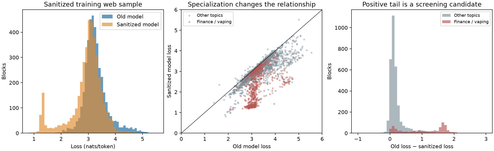

# Using paired model loss to screen web data

The loss difference is a promising way to discover specific template families in this corpus. Absolute old-model loss finds additional malformed text. Neither quantity is a general quality label, and no dataset was modified by this experiment.

I scored 4,096 uniformly sampled, distinct, aligned 1,024-token blocks from the sanitized **training web portion**: 4,194,304 tokens, seed 1729. Both models scored exactly the same next-token transitions with the production tokenizer. Models were `35m_balanced_1b` and `35m_newbalsanitized_1b`, evaluated with FP32 parameters and BF16 autocast. These are packed blocks, potentially containing parts of multiple documents, rather than independent full-document observations.

For per-token negative log-likelihoods, define:

\[
\Delta(x)=L_{\mathrm{old}}(x)-L_{\mathrm{sanitized}}(x).
\]

A positive value means the sanitized model assigns greater probability to the text. Under identical contexts, it is the average log probability ratio in favor of the sanitized model. It measures specialization, which can reflect either useful adaptation or unwanted templates.

Mean losses were 3.275 and 2.928 nats/token. The median difference was only **0.141**, whereas the top 10% of differences started at **1.228**. Thus the upper tail is substantially larger than the typical improvement; the sanitized model's lower overall loss does not make this comparison unusable. Subtracting a single global baseline changes the score's interpretation, but does not change its ranking.

I also tried an exploratory conditional baseline: divide old-model loss into 20 quantile bins and subtract the median difference in the corresponding bin:

\[
s(x)=\Delta(x)-\operatorname{median}(\Delta\mid L_{\mathrm{old}}\text{ bin}).
\]

This asks whether the sanitized model improves unusually much relative to other text with comparable old-model loss. The medians were fitted on this same sample; this is a diagnostic, not an independently calibrated detector.

| Ranking, highest 10% (410 blocks) | Finance/vaping keyword flag | Average old loss | Average sanitized loss |
|---|---:|---:|---:|
| Old-model loss | 16.6% | 4.253 | 3.541 |
| Old minus sanitized loss | 90.0% | 3.308 | 1.678 |
| Conditional difference | 94.9% | 3.165 | 1.567 |

The keyword flag occurs in **18.3% of the whole sample**. It is deliberately broad, includes legitimate articles, and misses some spam variants. These percentages measure topic enrichment, **not spam precision or recall**. The highest 10% of raw differences account for 46.6% of the sample's summed positive differences; that is loss concentration, not a prediction of performance after retraining.

Reviewing the beginning, middle, and end of the 12 highest-ranked examples per method showed complementary patterns:

- **Absolute old loss:** the extreme examples contained garbled dating-site prose, malformed gambling pages, and incoherent fortune-telling text. Some blocks also included adjacent coherent articles. Low finance/vaping enrichment therefore does not imply this ranking is useless for finding spam.
- **Raw difference:** 11 of the 12 examples began with unmistakable vaping word salad; the first combined an affiliate-commerce template with vaping word salad later in the block.
- **Conditional difference:** ten examples began with nonsensical loan prose; two began with commercial/product templates, one of which contained vaping word salad later. This narrower ranking is especially sensitive to loan templates whose old-model loss looks quite ordinary.

For example, block `68628480` has old loss **3.287** (near the ordinary range) and sanitized loss **1.329**, despite text such as “La società di assicurazioni è un'attitudine costante” followed by inconsistent timelines and unrelated nouns. An old-loss outlier threshold would miss it. Conversely, dating spam at block `160866304` has losses **5.537 / 3.912** and is discovered directly by the old-loss tail. Gambling spam at `436792320` has losses **5.072 / 4.741**, so a large-gap-only filter would miss it.

The scatterplot shows a group with ordinary old loss around 3 but sanitized loss around 1.3. Combined with the decoded nonsense, this is evidence of unusually predictable template families, rather than evidence that low loss itself means good Italian. Random review examples also demonstrate why block-level decisions need care: `461948928` starts with a coherent local-news article and ends with loan word salad; `116785152` mixes a coherent technology article with awkward office-chair commerce text. Removing an entire packed block or adjacent document indiscriminately could lose useful material.

## How I would use it

1. **Maintain two review queues:** unusually large paired differences (including the conditional score), and extreme absolute loss. Keep low-loss repetitive text in scope too. The old model was trained on dirty data itself, so spam familiar to both models may appear in neither tail.
2. **Map candidate blocks to document spans and template families.** Score consistent windows within documents, and aggregate local scores so a good article is not rejected solely because its packed neighbor is spam. Cluster repeated structures or domains before judging prevalence and deciding removals.
3. **Label a stratified sample**, including middle-ranked text and useful technical, literary, conversational, and financial writing. Use separate labels for incoherent word salad, boilerplate, coherent commercial text, and useful prose. Set thresholds from measured precision/recall on reviewed examples; do not assume “remove the top 10%” is the right quota.
4. **Validate outside the scored training pool.** The sanitized checkpoint has already trained on these blocks. Its advantage includes in-sample learning, and the old checkpoint also has its own corpus biases. The previous validation/test audit found the same loan/vaping phenomenon on held-out text, supporting template generalization, but this new pilot establishes no independent detector accuracy. For a reusable filter, calibrate on held-out documents and evaluate on domains/template clusters absent from calibration; use a separately trained or cross-fitted reference when feasible.
5. **Judge the resulting dataset on external tasks and curated held-out prose.** Remove identified template families consistently from train/validation/test, preserve intended source/topic weights, and compare at the same token budget. A changed validation loss after filtering is not by itself a quality improvement.

Loss-based pruning has research precedent, but the relation between perplexity, domain composition, and downstream performance requires empirical validation. [Perplexed by Perplexity](https://arxiv.org/html/2405.20541v1) studies perplexity pruning with small reference models and also shows why held-out perplexity can be misleading when evaluating pruning choices. Our same-size, different-corpus comparison is a specialization diagnostic, not the same experiment.

## Artifacts and full-corpus follow-up

Summary statistics are in `notes/dataset_audit/loss_filter_probe.json`. All 4,096 offsets, paired losses, and decoded text are in `artifacts/dataset_audit/raw/loss_filter_probe_blocks.json`; ranked review examples are in `artifacts/dataset_audit/raw/loss_filter_probe_review.json`. The experiment is implemented in `loss_filter_probe.py`, and its distribution plot is `loss_filter_probe.png`.

The [full-corpus experiment](loss_filter_full.md) extends paired scoring to every sanitized training, validation, and test transition and provides the top 50,000 training windows with decoded text in Parquet. Its held-out results confirm that the web portion dominates the loss advantage; the ranked windows remain review candidates rather than validated quality labels.
