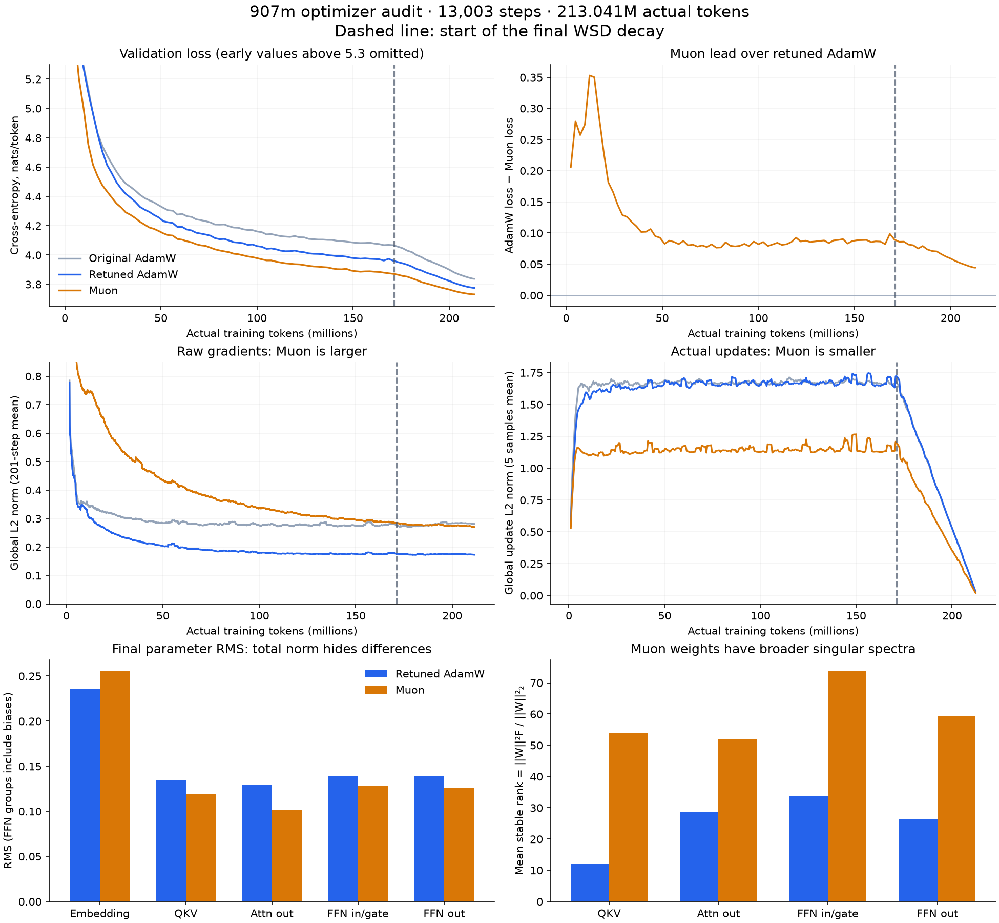

The three runs support a Muon improvement, and the audit found no evident optimizer-routing or scheduler bug. The shrinking loss gap and larger raw gradients are compatible with normal optimizer dynamics. The strongest opportunities are better validation, tuning the cooldown for Muon, and separating Q/K/V when studying matrix geometry.

Follow-up: [the full shorter-sweep audit](sweep_findings.md) analyzes all twelve `421m` LR/WD trajectories. It provides stronger evidence for inverse gradient/weight scaling, shows the LR×WD interaction and a cooldown ranking reversal, and identifies substantial clipping in the multiplier-0.25 run. Clipping conclusions below refer to the three selected long runs.

This audit reads the full scalar histories, the CSV configurations, the current model/training code, the installed PyTorch 2.9.1 Muon implementation, and all three final checkpoints. Reproduce it from the project root with `.venv/bin/python notes/muon_analysis/analyze.py`. The script writes `summary.json` and `comparison.png` beside itself. It performs CPU analysis, without training or changing saved models.

Run identity and comparability
==============================

| Label | Experiment | Final validation loss | Perplexity |
| --- | --- | ---: | ---: |
| Original AdamW | `10m_tuned_tok16k_907m` | 3.837989 | 46.432 |
| Retuned AdamW | `10m_tok16k_907m_b20.99_wd0.05` | 3.776048 | 43.643 |
| Muon | `10m_16k_907m_muon_lr0.5_mwd0.0` | 3.731575 | 41.745 |

Muon reduces loss by 0.044473 nats/token, or perplexity by 4.35%, relative to retuned AdamW. The two specified AdamW runs both have WD=0.05; their beta2 changes from 0.9025 to 0.99. Their final-loss difference is 0.061941.

All three use 10,635,520 parameters, identical recorded architecture and initialization settings, seed 42, batch size 16, sequence length 1024, 219 warmup steps, and 13,003 total steps. The initial global parameter norms match. Each checkpoint's exact configuration string matches its CSV row, and the final logged validation losses match the CSV within float32 logging precision. The original run predates the explicit norm-LR control, but its norm LR is equivalent to the later multiplier of 1.0. This checks recorded comparability, not bitwise reproducibility or historical source provenance: checkpoints do not contain a code revision.

The dataset name `907m` is not the actual token count for these tokenized artifacts: the event configuration declares 213,050,814 available training tokens, and each run processes 213,041,152. Use `train/tokens_seen` when comparing horizons. This naming issue does not invalidate this matched comparison.

How the lead changes
====================

| Step | Actual tokens, millions | Retuned AdamW loss minus Muon loss |
| ---: | ---: | ---: |
| 745 | 12.206 | 0.352893 |
| 2,980 | 48.824 | 0.092510 |
| 5,960 | 97.649 | 0.086276 |
| 10,430 | 170.885 | 0.089305 |
| 11,920 | 195.297 | 0.065975 |
| 13,003 | 213.041 | 0.044473 |

There are three phases: a large early advantage, a middle region with a roughly stable 0.08–0.09 lead, and another contraction during cooldown. It is not a continuous deterioration throughout training.

Both optimizers use the same WSD multiplier. The final 2,557-step decay begins at scheduler index 10,446, around 171.15M processed tokens. From the last validation before decay (step 10,430) to the end, AdamW improves by 0.184956 and Muon by 0.140124. This accounts for about half of the pre-cooldown gap disappearing. The larger AdamW updates during the stable phase are consistent with more benefit from lowering the learning rate; this is a plausible explanation, not a causal identification of a noise floor.

An optimizer that learns useful structure faster need not preserve a constant absolute loss advantage as learning slows. This run alone does not establish a common asymptotic loss, saturation, or what will happen at several times this horizon.

Muon also has an implicit reduction in its relative step before the explicit cooldown: at step 990, hidden-matrix update norm is 0.5570 and parameter norm is 89.40 (relative update 0.00623); at step 9,990 they are 0.5604 and 293.33 (relative update 0.00191). Thus its absolute update stays nearly constant while its angular/relative movement falls about 3.3-fold. Norm growth is worth monitoring, but is not sufficient evidence that weight decay or an increasing LR would improve the result.

Gradients, updates, and magnitudes
=================================

Means over steps 8,000–10,440 (before cooldown):

| Metric | Retuned AdamW | Muon |
| --- | ---: | ---: |
| Global raw gradient L2 norm | 0.1761 | 0.2955 |
| Global actual update L2 norm | 1.6777 | 1.1588 |
| Attention-output raw gradient L2 norm | 0.0450 | 0.1354 |
| FFN-input/gate raw gradient L2 norm | 0.0768 | 0.1407 |
| Embedding share of squared gradient norm | 25.16% | 7.61% |
| Attention-output share of squared gradient norm | 6.72% | 20.91% |
| FFN-input/gate share of squared gradient norm | 19.63% | 22.66% |

Gradient shares are the mean of each sampled step's squared group norm divided by total squared norm. These disjoint groups include FFN biases. A raw group L2 norm is affected by its number of entries; gradient RMS is preferable when comparing the typical gradient entry across differently sized groups. Neither statistic measures a group's causal contribution to reducing loss.

Muon approximately normalizes the momentum matrix and flattens its singular spectrum before stepping. Multiplying the whole gradient/momentum history by a positive constant largely leaves the update unchanged, apart from numerical effects. AdamW also transforms raw gradients through moment estimates. Consequently, larger gradients across two separately trained networks do not imply larger parameter updates or worse optimization. The log comparison demonstrates the opposite here. See the [Muon design](https://kellerjordan.github.io/posts/muon/) and [PyTorch 2.9 API](https://docs.pytorch.org/docs/2.9/generated/torch.optim.Muon.html).

There is no evidence that late clipping causes the contraction: neither retuned AdamW nor Muon clips any gradient from step 8,000 onward. Whole-run clipping fractions are 0.338% and 1.277%, respectively; most Muon clipping is in the first 300 steps. Global clipping can change the relative weighting of successive gradients in momentum, but it is not the late-run explanation here.

Final checkpoint parameter RMS:

| Group | Retuned AdamW | Muon | Muon change |
| --- | ---: | ---: | ---: |
| Tied embedding/output | 0.23569 | 0.25540 | +8.4% |
| QKV | 0.13418 | 0.11967 | −10.8% |
| Attention output | 0.12913 | 0.10182 | −21.1% |
| FFN input/gate, including biases | 0.13934 | 0.12805 | −8.1% |
| FFN output, including biases | 0.13937 | 0.12644 | −9.3% |

Global parameter norm changes only from 599.57 to 613.82: larger embeddings mask smaller hidden matrices. The 4.19M-entry embedding accounts for about 65% of final squared parameter norm in AdamW and 73% in Muon. Its optimizer also handles the tied output head, so the embedding gradient combines input and output roles.

Magnitudes alone still do not explain a threefold attention-output gradient difference. Spectra differ substantially. For the eight QKV weight matrices, the mean spectral norm is 17.22 with AdamW versus 7.41 with Muon; mean stable rank is 11.95 versus 53.90. Stable rank is squared Frobenius norm divided by squared largest singular value; larger values indicate energy spread across more singular directions. The other hidden groups also have higher stable rank with Muon. These are weight spectra, not direct measurements of gradient spectra or the Hessian. They demonstrate why a similar RMS does not imply similar activation or gradient propagation. The [Moonlight paper](https://arxiv.org/html/2502.16982v1) also studies flatter learned weight spectra.

RMSNorm and QK normalization introduce further dependence on parameterization and activation scale. Smaller weights can produce larger gradients along approximately scale-invariant directions. This makes the reported inverse LR/gradient relationship plausible, but these checkpoints cannot prove it is entirely a norm effect.

Implementation details and experiment priorities
================================================

1. **Validate small differences on more data and seeds first.** Each logged validation uses the same first 7 batches: only 114,688 tokens of an 8.36M-token validation artifact. This is useful for curves, but repeated hyperparameter selection on that prefix can overfit it. Evaluate all final candidates on a substantially broader shared validation set, retaining a separate test set if feasible, and repeat the closest candidates with more seeds. The current machine's NVIDIA driver is unavailable, so this audit did not rerun GPU validation. No uncertainty interval is inferred from the scalar logs.

2. **Tune the cooldown at this actual horizon.** With the current Muon multiplier 0.5 and auxiliary AdamW LR held fixed, compare `WSD_DECAY_FRACTION=0.1,0.2,0.4` at the same total steps. The logs motivate the test but do not determine which direction will win. If pursuing separate Muon and auxiliary schedules, introduce and record explicit environment controls; do not assume the AdamW-tuned shared schedule is optimal for both optimizers. The choice of multiplier 0.5 itself was primarily selected on the shorter `421m` runs; a narrow longer-horizon LR confirmation is also warranted.

3. **Treat zero decay as provisional.** The three long Muon results are 3.731575 at WD=0, 3.732549 at WD=0.05, and 3.738267 at WD=0.10. Zero versus 0.05 differs by just 0.000974. In the shorter sweep, zero versus 0.10 at multiplier 0.5 differs by only 0.000156. This does not establish a universal zero-decay preference. Muon still improves substantially at either nonzero setting, so its gain is not explained solely by removing WD.

   `WEIGHT_DECAY=0.05` in the hybrid CSV has no active target: the AdamW decay group is empty, while embeddings, norms, and biases all have explicit zero decay. With `MUON_WEIGHT_DECAY=0`, the whole hybrid model has no explicit weight decay. This follows the intended grouping rather than an optimizer bug. Also, PyTorch applies decay using the unadjusted Muon LR: with multiplier 0.5, Muon WD=0.10 gives the same explicit per-step shrinkage factor as baseline AdamW WD=0.05. Shape adjustment changes the gradient update, not decay.

4. **Log Q, K, and V separately and consider an orthogonalization ablation.** `c_attn.weight` is one 768×256 matrix. Muon operates jointly on it before the forward pass splits Q/K/V. In the ideal full-column-rank polar update, the right-side preconditioner depends on the sum of the three blocks' Gram matrices. Separate Muon updates would precondition each block independently, so fusion changes the optimizer mathematically. This matters because Q/K are normalized and V is not. At the final checkpoint, Q/K/V RMS is 0.14355/0.13251/0.12588 for AdamW and 0.10635/0.10586/0.14299 for Muon. These measurements motivate the ablation but do not establish that fusion is harmful. A valid split experiment must use separate momentum/orthogonalization and recompute each block's shape adjustment; merely splitting the forward activation does not do it.

5. **Compare actual updates by functional group, including the auxiliary optimizer.** Port the hybrid's exact before/after delta diagnostics to AdamW and add per-layer and Q/K/V measurements. Log weight RMS, gradient RMS, update RMS, update/weight norm, and signed radial/tangential changes. For a first-order measure of immediate descent, log `-<gradient, actual_update>` by group, preferably separating adaptive motion from weight decay. Log residual-branch activation RMS and sampled attention logits if investigating sensitivity. The current `diagnostics/logit_*` tags measure vocabulary logits, not QK attention logits. Raw gradient shares alone should not drive LR allocation.

   The tied embedding/output weights are about 39.4% of all parameters and receive about 76.5% of the hybrid's squared update norm in the late stable window (from aggregated update statistics, approximately). Reusing the auxiliary AdamW configuration is a valid starting point, not evidence that it remains optimal. After resolving schedule uncertainty, test an independently controlled auxiliary/embedding LR. Keep Muon's absolute LR fixed when doing so: changing the shared `LR` currently also changes `LR * MUON_LR_MULTIPLIER`.

No change to beta2, clipping, QK normalization, or norm decay is justified merely by Muon's larger gradients. A larger late gradient norm is not a failure condition, and the present evidence favors targeted ablations over a broad optimizer rewrite.

Measurement caveats
===================

The AdamW script reconstructs its last parameter delta algebraically from its FP32 moment state and post-step weights; the hybrid measures actual before/after differences. Both include decay, but floating-point reconstruction can differ slightly. AdamW parameter-norm diagnostics are pre-step and hybrid global norms post-step; final updates have LR zero, so final checkpoint comparisons avoid this timing mismatch. Muon group gradient tags include FFN biases whereas `optimizer/muon_groups/*` excludes those AdamW-owned biases.

The recorded first-to-last training scalar duration is approximately 18.21 minutes for retuned AdamW and 21.95 minutes for Muon. This is a quality-at-equal-tokens comparison, not a demonstrated wall-clock speedup. The hybrid additionally copies parameters to CPU and computes richer diagnostics every 30 steps, so those durations are not a clean benchmark of optimizer overhead.
