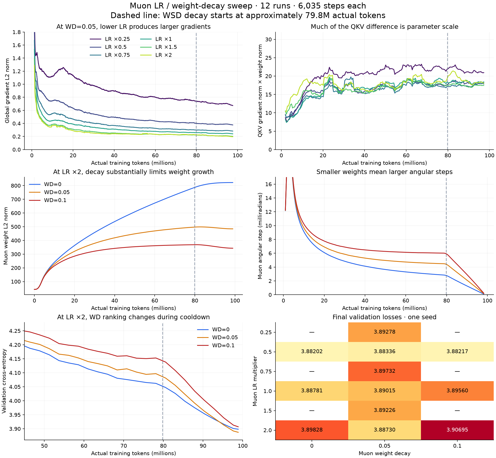

The twelve shorter Muon runs materially strengthen the parameter-scale explanation for larger gradients at lower LR. They also show that weight decay changes the effective angular step, with a strong LR interaction and a ranking reversal during cooldown. The initial audit inspected their final CSV results but did not analyze these shorter trajectories; this supplement does.

All twelve runs have identical recorded training configurations except `MUON_LR_MULTIPLIER` and `MUON_WEIGHT_DECAY`. They each process 6,035 optimizer steps, or 98,877,440 actual tokens. The `421m` artifact contains 98,888,867 tokens with this tokenizer. The final WSD decay starts at scheduler index 4,871, approximately 79.8M tokens. Final checkpoint configurations match the CSV and final TensorBoard validation values agree to float32 precision. As before, this is an audit of existing single-seed results, not new training or evaluation.

Reproduce using `.venv/bin/python notes/muon_analysis/analyze_sweep.py`. Numerical results are in `sweep_summary.json`; the plot is `sweep_comparison.png`.

The complete final-loss grid
============================

| Muon LR multiplier | WD=0 | WD=0.05 | WD=0.10 |
| ---: | ---: | ---: | ---: |
| 0.25 | — | 3.892776 | — |
| 0.50 | 3.882019 | 3.883364 | 3.882175 |
| 0.75 | — | 3.897319 | — |
| 1.00 | 3.887811 | 3.890150 | 3.895604 |
| 1.50 | — | 3.892263 | — |
| 2.00 | 3.898275 | 3.887298 | 3.906949 |

The run names without an `mwd` suffix use WD=0.05, not zero. Multiplier 0.5 is the best tested multiplier at every tested WD. Its WD sensitivity is small in final loss, despite clear differences in its internal dynamics. The nonmonotonic LR grid and small margins should not be read as a precisely located optimum. Validation still uses only the same 114,688-token prefix and one seed.

Lower LR, larger gradients: direct evidence
==========================================

The following are means over steps 3,600–4,800, before cooldown. Weight and update norms here refer only to the Muon-owned hidden matrices; gradient norms are measured before clipping.

| LR multiplier, WD=0 | Hidden weight norm | Hidden update norm | Relative update | QKV gradient norm | QKV gradient norm × QKV weight norm |
| ---: | ---: | ---: | ---: | ---: | ---: |
| 0.5 | 186.51 | 0.5592 | 0.003004 | 0.20443 | 18.13 |
| 1.0 | 364.22 | 1.1157 | 0.003070 | 0.10737 | 18.97 |
| 2.0 | 724.19 | 2.2232 | 0.003077 | 0.05347 | 19.14 |

Fourfold LR produces approximately fourfold weights and fourfold updates. The QKV gradient falls almost fourfold, while the relative update barely changes. FFN-output gradient norm × matrix weight norm is also nearly invariant: 13.49, 13.24, and 13.56. For FFN groups the gradient tag includes AdamW-owned biases while the matrix norm excludes them, so those products are not exact matched parameter-set measures.

The final checkpoints independently confirm this pattern: QKV RMS at multipliers 0.5, 1.0, and 2.0 with zero decay is 0.0804, 0.1601, and 0.3233. Embedding RMS is 0.1828, 0.1744, and 0.1671. Global model RMS obscures the large hidden-weight change because the embeddings stay on fixed-LR AdamW.

For an exactly scale-invariant function, `f(cW)=f(W)` implies `gradient(cW)=gradient(W)/c`. Your full model is not exactly scale-invariant, but normalization introduces approximate scale-invariant directions. Muon also approximately removes overall momentum magnitude before forming an update. Together these facts explain why an apparently counterintuitive gradient increase can accompany a smaller LR without implying less stable optimization.

At WD=0.05 the late mean global gradient norm falls with multiplier: 0.774 (0.25), 0.420 (0.5), 0.312 (0.75), 0.268 (1.0), 0.228 (1.5), and 0.230 (2.0). The leveling off at the high end is meaningful: the total gradient is not just a rescaled hidden-matrix gradient.

There are real functional differences beyond rescaling. With WD=0, RMSNorm gradient norm grows from 0.0431 at multiplier 0.5 to 0.1334 at 2.0, even though final aggregate norm-parameter RMS is similar (0.933 versus 0.941). Its share of squared gradient norm rises from 1.3% to 35.3%. Attention-output and FFN-input gradient×weight products are less invariant than QKV and FFN-output products. Thus the explanation is strongest for some matrix groups, and keeping auxiliary AdamW hyperparameters fixed does not keep its functional effect fixed.

WD changes angular learning dynamics
===================================

At multiplier 2.0, over the same pre-cooldown window:

| Muon WD | Hidden weight norm | Hidden update norm | Angular step, radians | QKV gradient norm | Global gradient norm |
| ---: | ---: | ---: | ---: | ---: | ---: |
| 0 | 724.19 | 2.2232 | 0.003074 | 0.05347 | 0.22129 |
| 0.05 | 482.96 | 2.2227 | 0.004603 | 0.08041 | 0.22951 |
| 0.10 | 365.20 | 2.2176 | 0.006072 | 0.10394 | 0.25161 |

Stronger decay halves the weight norm while leaving the update magnitude nearly unchanged, nearly doubling the angular step. The QKV gradient nearly doubles too. Yet QKV gradient norm × weight norm stays near 19.14, 18.84, and 18.13. This is much stronger evidence for a scale effect than comparing global parameter norms across optimizers.

Decay does not directly enlarge the backpropagated gradient: it is decoupled from the training objective. It changes weights and the subsequent training trajectory. Smaller weights can then produce larger gradients and a larger update relative to their size. The update-weight cosine at multiplier 2, WD=0.10 is only 0.000125 in the stable window, so the net motion is overwhelmingly tangential even while decay strongly changes the trajectory of parameter norms. A near-zero cosine does not mean decay is inactive; radial contributions can balance and can cancel across matrices.

The installed PyTorch 2.9.1 implementation applies

`W_next = (1 - eta * WD) * W - eta * shape_factor * orthogonalized_momentum`.

Hence increasing LR at fixed WD changes both absolute update size and per-step shrinkage. At WD=0.05, the product of the decay factors across the entire run is 0.726 for multiplier 0.5, 0.527 for multiplier 1.0, and 0.277 for multiplier 2.0. These numbers describe decay-only retention of an existing weight contribution, not the model's final net weight norm.

Your sweep already includes pairs with equal `eta * WD`:

| Multiplier / WD | Late angular step |
| --- | ---: |
| 0.5 / 0.10 | 0.003768 |
| 1.0 / 0.05 | 0.003826 |
| 1.0 / 0.10 | 0.004602 |
| 2.0 / 0.05 | 0.004603 |

This near-equality is striking. It indicates a useful approximate scaling relation, not interchangeable experiments: initialization is not rescaled and embeddings/vectors remain on the same AdamW LR. Their losses are not identical. Holding the LR×WD product fixed is a useful control when studying this phenomenon, while holding WD fixed answers a different tuning question.

These findings are consistent with Muon's normalized updates and the role of decay in controlling weight growth discussed in the [Moonlight paper](https://arxiv.org/html/2502.16982v1). The paper's large-model findings do not establish that more WD would improve this small model.

Cooldown can reverse the WD ranking
==================================

At multiplier 2.0:

| WD | Validation at step 4,768, before cooldown | Final validation | Improvement |
| ---: | ---: | ---: | ---: |
| 0 | 4.062185 | 3.898275 | 0.163910 |
| 0.05 | 4.096823 | 3.887298 | 0.209525 |
| 0.10 | 4.152887 | 3.906949 | 0.245938 |

WD=0.05 is worse than zero decay before cooldown but better afterward. Higher WD receives a larger cooldown benefit, although WD=0.10 still finishes worst. Its larger stable-phase angular steps are consistent with higher optimization noise that cooldown reduces; the logs do not directly identify noise or rule out other mechanisms.

At multiplier 0.5, zero decay and WD=0.10 finish essentially tied (difference 0.000156) even though their weight norms and angular steps differ. WD's small effect on final validation should not be mistaken for a small effect on optimization. The relevant quantities are LR, WD, and schedule jointly. This also reinforces the earlier observation that cooldown changes the AdamW–Muon gap.

One clipping caveat specific to the sweep
========================================

The multiplier-0.25, WD=0.05 run clips on 1,636 of 6,035 steps, or 27.11%. The multiplier-0.5 run at the same WD clips on 174 steps (2.88%); multipliers 1 and 2 clip on 1.38% and 1.21%. Most low-LR clipping occurs earlier, but it persists sporadically until step 5,121. The late stable window's clipping rate is 0.83%, not 27%; the latter is the whole-run rate.

The script clips all parameters jointly before either optimizer steps. Therefore larger raw Muon-matrix gradients can also scale the gradients sent to auxiliary AdamW. Constant gradient scaling can largely cancel in normalized/adaptive optimizers, but a changing clipping coefficient alters momentum history and need not cancel. This is a confound when interpreting why multiplier 0.25 loses, not proof that clipping caused the loss difference.

The previous advice to leave clipping alone was appropriate to the selected long multiplier-0.5 run's late dynamics. It should not be generalized to every point in this sweep. If revisiting multiplier 0.25, compare clipping coefficients over time and consider an optimizer-specific clipping ablation while retaining finite-gradient checks. Do not simply lower LR again in response to a larger raw norm.

Updated practical conclusion
============================

Keep multiplier 0.5 as the empirical best tested choice; the wider sweep supports it. Treat WD 0, 0.05, and 0.10 as nearly tied at that multiplier until broader evaluation resolves small differences. The already-completed sweeps should not be repeated unchanged.

For the next experiments, prioritize the interaction of decay and cooldown at multiplier 0.5, and measure relative/angular updates rather than trying to equalize gradient norms. When changing LR to study mechanisms, distinguish fixed-WD experiments from fixed-LR×WD controls. Only revisit multiplier 0.25 with its different clipping regime made explicit. If trying larger multipliers, investigate the growing norm-parameter gradients and independently controlled auxiliary LR rather than assuming unchanged AdamW settings imply unchanged dynamics.

These results support a concrete explanation of the peculiarities without indicating a sign error, wrongly applied decay, or incorrect Muon parameter grouping.
